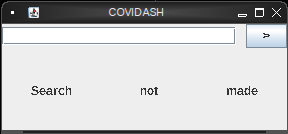
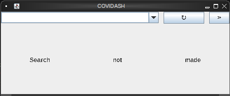
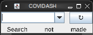
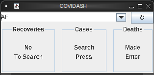

Will be a desktop app written in #java. The project uses several [libraries](lib.md).

##### First prototype (0.1) :
accomodates all three kinds of data

###### Second prototype (0.3) :
switch to using a combobox, add a refresh button because it appears temporarily storing data is necessary

###### Third prototype (0.4) :
remove go button because users will probably know to press enter

###### Fourth prototype (0.6) :
update form so it can display all the data
